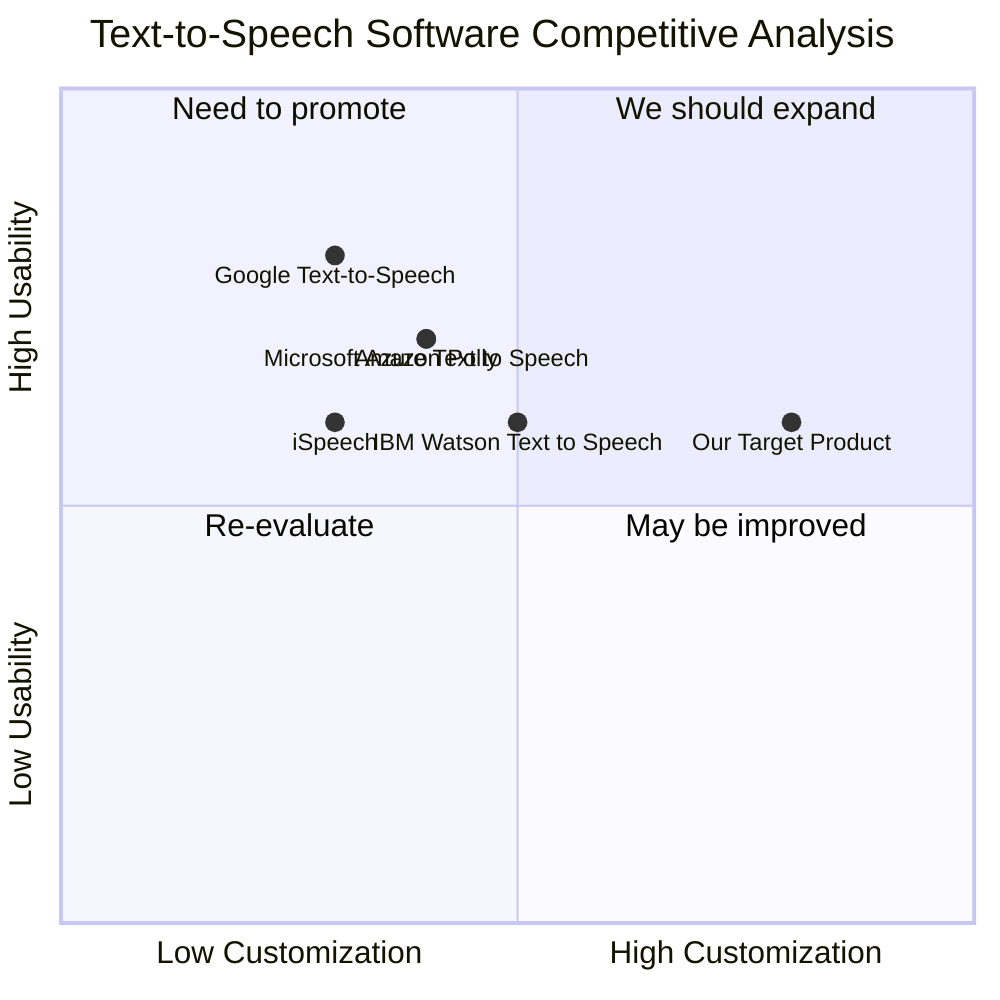

## Original Requirements
The boss wants a system that takes an audio input of a person's voice, creates a vocal model, saves it, and then loads it to perform text-to-speech on any given text. The software operates from the command line and consists of two main programs: 1) trainer.py that creates the vocal model having one or more audio file names on the command line. 2) tts.py that loads the vocal model and, given a text file input from the command line, plays it with that vocal model.

## Product Goals
```python
[
    "Create a system that can accurately model a person's voice from audio input",
    "Develop a text-to-speech feature that can utilize the created vocal model",
    "Ensure the software operates efficiently from the command line"
]
```

## User Stories
```python
[
    "As a user, I want to be able to input an audio file and have the system create a vocal model",
    "As a user, I want the system to save the created vocal model for future use",
    "As a user, I want to input a text file and have the system perform text-to-speech using the saved vocal model",
    "As a user, I want the software to operate efficiently from the command line",
    "As a user, I want to be able to use multiple audio files to create a more accurate vocal model"
]
```

## Competitive Analysis
```python
[
    "Google Text-to-Speech: Offers a wide range of voices and languages, but lacks the ability to create a custom vocal model",
    "Amazon Polly: Provides lifelike voices and supports a variety of languages, but does not allow for custom vocal model creation",
    "IBM Watson Text to Speech: Supports a variety of voices and languages, and allows for some customization, but does not support custom vocal model creation",
    "Microsoft Azure Text to Speech: Offers a wide range of voices and languages, and allows for some customization, but lacks the ability to create a custom vocal model",
    "iSpeech: Provides a variety of voices and languages, but does not support custom vocal model creation"
]
```

## Competitive Quadrant Chart


## Requirement Analysis
The product should be a command-line software that can create a vocal model from audio input, save the model, and use it for text-to-speech functionality. It should be able to handle multiple audio files for more accurate vocal model creation.

## Requirement Pool
```python
[
    ("Create a vocal model from audio input", "P0"),
    ("Save the created vocal model", "P0"),
    ("Load the saved vocal model for text-to-speech", "P0"),
    ("Operate efficiently from the command line", "P0"),
    ("Handle multiple audio files for vocal model creation", "P1")
]
```

## UI Design draft
As a command-line software, the UI will be text-based. The user will input commands to perform tasks such as creating a vocal model, saving the model, loading the model, and performing text-to-speech. The software should provide clear instructions and error messages to guide the user.

## Anything UNCLEAR
There are no unclear points.