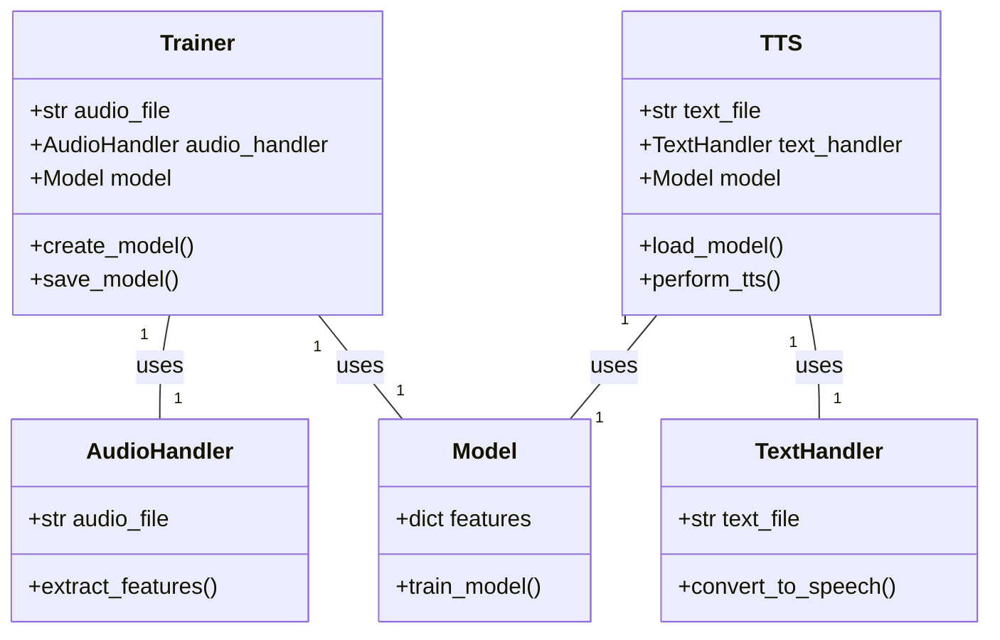
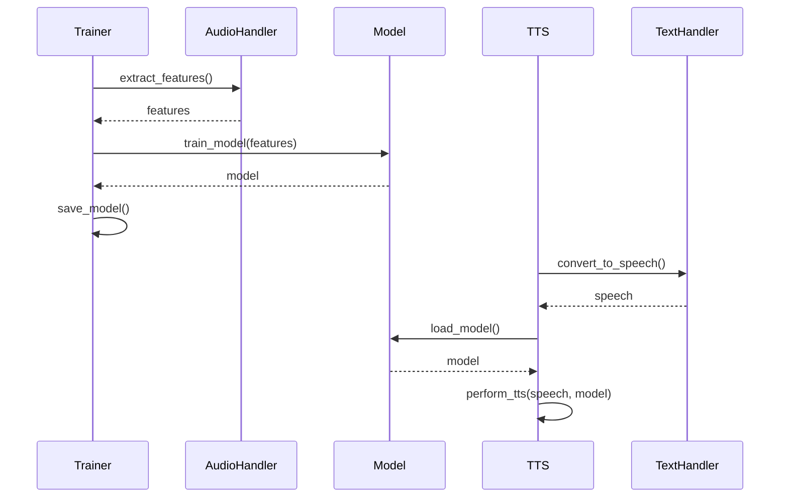

## Implementation approach
We will use Python's open-source libraries to implement this system. For speech recognition, we will use the "SpeechRecognition" library. For audio file handling, we will use "pydub". To create a vocal model, we will use "pyAudioAnalysis" for feature extraction and "scikit-learn" for model training. For text-to-speech, we will use "gTTS" (Google Text-to-Speech). The system will be command-line based, so we will use Python's built-in "argparse" library to handle command-line arguments.

## Python package name
```python
"voice_modeling_tts"
```

## File list
```python
[
    "trainer.py",
    "tts.py",
    "model.py",
    "audio_handler.py",
    "text_handler.py"
]
```

## Data structures and interface definitions


## Program call flow


## Anything UNCLEAR
The requirement is clear to me.